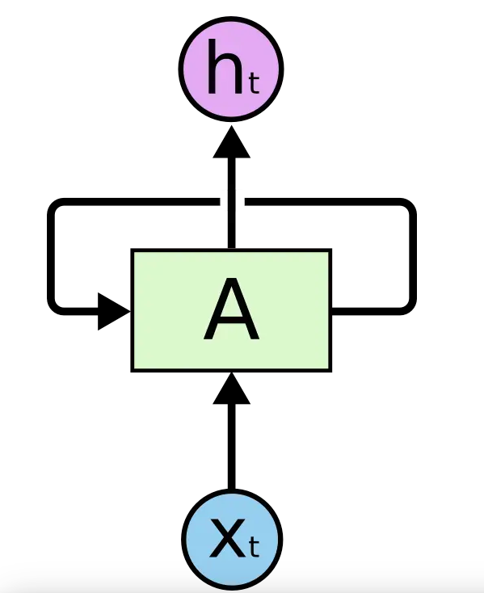
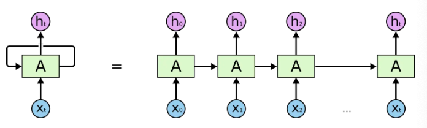

# RNN 
循环神经网络  
我们人类并不是每时每刻都从一片空白的大脑开始思考,当你在阅读这句话的时候,你都是基于自己已经拥有的对先前所见词的理解来推断当前词的真实意思  
我们不会将所有的东西都全部丢弃,然后用空白的大脑进行思考,我们的思想拥有持久性  
但在传统的神经网路并不能做到这点,例如假设你希望对电影中的每个时间点的时间类型进行分类,传统的神经网络应该很难来处理这个问题,使用电影中先前的  
时间推断后续的事件。  
RNN解决了这个问题,RNN是包含循环的网络,允许信息的持久化

在这个图中,神经网络的模块A正在读取某个输入x,并且输出一个值h,循环可以使得信息可以从当前步骤传递到下一步  
这些循环使得RNN看起来非常神秘,然而，如果你仔细想象,这样也不比一个正常的神经网络难于理解,RNN可以被看做是  
同一神经网络的多次复制,每个神经网络模块会把消息传递给下一个,所以,如果我们把这个循环展开:
  
这个连标特征解释了RNN本质上是和列表相关的,他们是对这类数据的最自然的神经网络架构,并且RNN也被人们广泛应用在语音识别,  
翻译,图片等领域,而这些领域成功的关键之外就是LSTM的使用,它是一种特别的RNN,比RNN在很多任务上表现的都要好 

## RNN的缺点
RNN关键点之一就是他们可以用来链接前面的信息当当前的任务上,比如使用过去的视频帧来预测当前的视频帧,或者使用过去的文本来预测当前的文本  
有的时候我们只需要知道先前的信息来执行当前的任务,比如我们有一个语言模型用来基于前面的词来预测下一个词,如果我们试着预测"the clouds are in the sky",  
我们不需要任何额外的上下文,但是有的时候我们需要更多的上下文,比如我们想要预测"I grew up in France...I speak fluent French",这里的"French"是指语言还是人呢?  
我们需要到先前提到的离当前位置很远的France的上下文,这说明相关信息和当前预测位置之间的间隔就肯定变的相当大,在这个间隔不断增大的时候,RNN会丧失学习到链接如此远的信息的能力  
LSTM是一种特殊的RNN,可以学习到如此长的间隔,他们被设计来避免长期依赖问题

# LSTM
Long Short Term网络 -- 一般就叫做LSTM它是一种特殊的类型,可以学习长期依赖信息,LSTM通过刻意的设计来避免长期依赖问题,记住长期的信息在实践中是LSTM的默认行为
## 例子  
